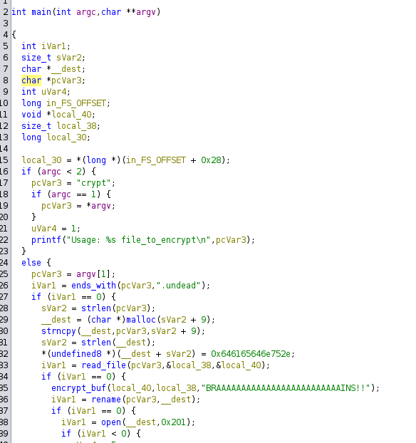
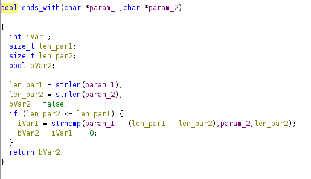

# Challenge Name

**Category:** Reverse Engineering <br>
**Difficulty:** Very Easy <br>
**Platform:** HTB <br>
**Binary:** CryptOfTheUndead <br>

## 📝 Challenge Description
All my important files have been zombified by the notorious Zombie Cybercrime Gang. Can you lay them to rest and bring my files back?


## 🔍 Initial Recon


I keep getting message "error: that which is undead may not be encrypted" when I run ./crypt flag.txt.undead. So I look into the ends_with func. 


## 🔧 Analysis 


This func forcefully turns our argv[1] into ".undead". Then with strncmp function, It returns 0 which evaluates to false. What I try to do was letting it to return 1 instead of 0 so that I can go inside the if condition. 

mv flag.txt.undead flag.txt.undeada


## ✅ Result
```bash
root@kali:~/Documents/htb/CryptOfTheUndead# ./crypt flag.txt.undeada 
successfully zombified your file!
root@kali:~/Documents/htb/CryptOfTheUndead# ls
crypt  flag.txt.undeada.undead
root@kali:~/Documents/htb/CryptOfTheUndead# cat flag.txt.undeada.undead 
HTB{und01ng_th3_curs3_0f_und34th}

```

## 🚩 Flag
HTB{und01ng_th3_curs3_0f_und34th}
