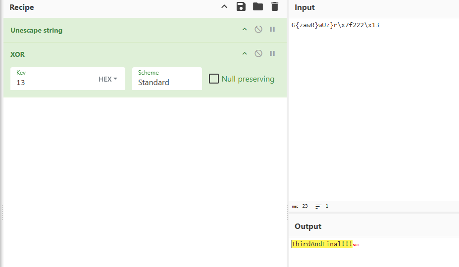

# Challenge Name

**Category:** Reverse Engineering
**Difficulty:** Very Easy
**Platform:** HTB 
**Binary:** wide & db.ex

## 📝 Challenge Description
STOP! Adventurer, have you got an up to date relic hunting license? If you don't, you'll need to take the exam again before you'll be allowed passage into the spacelanes!


## 🔍 Initial Recon
```bash
   uStack_10 = sym.imp.readline("Okay, first, a warmup - what\'s the first password? This one\'s not even hidden: ");
    iVar1 = sym.imp.strcmp(uStack_10,"PasswordNumeroUno");
    if (iVar1 != 0) {
        sym.imp.puts("Not even close!");
    //WARNING: Subroutine does not return
        sym.imp.exit(0xffffffff);
    }
    sym.imp.free(uStack_10);
    uStack_1c = 0;
    uStack_14 = 0;
    sym.reverse(&uStack_1c,"0wTdr0wss4P",0xb);
    uStack_10 = sym.imp.readline("Getting harder - what\'s the second password? ");
    iVar1 = sym.imp.strcmp(uStack_10,&uStack_1c);
    if (iVar1 != 0) {
        sym.imp.puts("You\'ve got it all backwards...");
    //WARNING: Subroutine does not return
        sym.imp.exit(0xffffffff);
    }
    sym.imp.free(uStack_10);
    uStack_38 = 0;
    uStack_30 = 0;
    uStack_28 = 0;
    sym.xor(&uStack_38,"G{zawR}wUz}r\x7f222\x13",0x11,0x13);
    uStack_10 = sym.imp.readline("Your final test - give me the third, and most protected, password: ");
    iVar1 = sym.imp.strcmp(uStack_10,&uStack_38);
    if (iVar1 != 0) {
        sym.imp.puts("Failed at the final hurdle!");
    //WARNING: Subroutine does not return
        sym.imp.exit(0xffffffff);
    }
    sym.imp.free(uStack_10);
    return;
}

[0x0040128a]> s sym.xor
[0x00401237]> pdg

void sym.xor(int64_t param_1,int64_t param_2,uint64_t param_3,uint8_t param_4)

{
    uint uStack_c;
    
    for (uStack_c = 0; uStack_c < param_3; uStack_c = uStack_c + 1) {
        *(param_1 + uStack_c) = *(param_2 + uStack_c) ^ param_4;
    }
    return;
}

```

## 🔧 Analysis
Tools: radare2

Steps:
```Dynamic analysis (radare2)
r2 ./wide db.exe
aaa
afl
s sym.menu
pdg

```

## Result
First password is not even hidden. Second password is the reverse of 0wTdr0wss4P. Third one I used cyberchef to help me unescaped and xor character by character at the same time.



```bash
root@kali:~/Documents/htb# ./license 
So, you want to be a relic hunter?
First, you're going to need your license, and for that you need to pass the exam.
It's short, but it's not for the faint of heart. Are you up to the challenge?! (y/n)
y
Okay, first, a warmup - what's the first password? This one's not even hidden: PasswordNumeroUno
Getting harder - what's the second password? P4ssw0rdTw0
Your final test - give me the third, and most protected, password: ThirdAndFinal!!!
Well done hunter - consider yourself certified!

```

## Flag
HTB{l1c3ns3_4cquir3d-hunt1ng_t1m3!}
