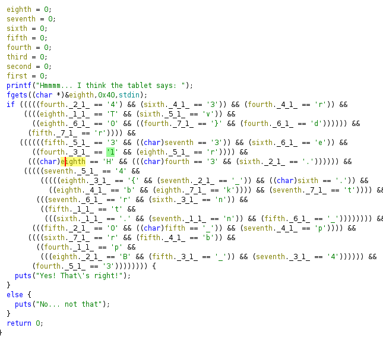

# Challenge Name

**Category:** Reverse Engineering
**Difficulty:** Very Easy
**Platform:** HTB 
**Binary:** Shattered Tablet

## 📝 Challenge Description
Deep in an ancient tomb, you've discovered a stone tablet with secret information on the locations of other relics. However, while dodging a poison dart, it slipped from your hands and shattered into hundreds of pieces. Can you reassemble it and read the clues?

## 🔍 Initial Recon
```bash
ulong main(void)

{
    ulong uStack_48;
    ulong uStack_40;
    ulong uStack_38;
    ulong uStack_30;
    ulong uStack_28;
    ulong uStack_20;
    ulong uStack_18;
    ulong uStack_10;
    
    uStack_48 = 0;
    uStack_40 = 0;
    uStack_38 = 0;
    uStack_30 = 0;
    uStack_28 = 0;
    uStack_20 = 0;
    uStack_18 = 0;
    uStack_10 = 0;
    sym.imp.printf("Hmmmm... I think the tablet says: ");
    sym.imp.fgets(&uStack_48,0x40,_reloc.stdin);
    if (((((uStack_28._2_1_ == '4') && (uStack_38._4_1_ == '3')) && (uStack_28._4_1_ == 'r')) &&
        ((((uStack_48._1_1_ == 'T' && (uStack_38._5_1_ == 'v')) &&
          ((uStack_48._6_1_ == '0' && ((uStack_28._7_1_ == '}' && (uStack_28._6_1_ == 'd')))))) &&
         (uStack_30._7_1_ == 'r')))) &&
       ((((((uStack_30._5_1_ == '3' && (uStack_40 == '3')) && (uStack_38._6_1_ == 'e')) &&
          ((uStack_28._3_1_ == '1' && (uStack_48._5_1_ == 'r')))) &&
         ((uStack_48 == 'H' && ((uStack_28 == '3' && (uStack_38._2_1_ == '.')))))) &&
        (((((uStack_40._5_1_ == '4' &&
            (((((uStack_48._3_1_ == '{' && (uStack_40._2_1_ == '_')) && (uStack_38 == '.')) &&
              ((uStack_48._4_1_ == 'b' && (uStack_48._7_1_ == 'k')))) && (uStack_40._7_1_ == 't')))) &&
           (((uStack_40._6_1_ == 'r' && (uStack_38._3_1_ == 'n')) &&
            ((uStack_30._1_1_ == 't' &&
             (((uStack_38._1_1_ == '.' && (uStack_40._1_1_ == 'n')) && (uStack_30._6_1_ == '_')))))))) &&
          (((uStack_30._2_1_ == '0' && (uStack_30 == '_')) && (uStack_40._4_1_ == 'p')))) &&
         ((((uStack_38._7_1_ == 'r' && (uStack_30._4_1_ == 'b')) &&
           ((uStack_28._1_1_ == 'p' &&
            (((uStack_48._2_1_ == 'B' && (uStack_30._3_1_ == '_')) && (uStack_40._3_1_ == '4')))))) &&
          (uStack_28._5_1_ == '3')))))))) {
        sym.imp.puts("Yes! That\'s right!");
    }
    else {
        sym.imp.puts("No... not that");
    }
    return 0;
}
```

## 🔧 Analysis
Tools: ghidra



Use renaming method for each uStack, for example uStack10 = first, uStack20 = second and so on.
## 4
fourth = 3 <br>
fourth11 = p <br>
fourth21 = 4 <br>
fourth31 = l <br>
fourth41 = r <br>
fourth51 = 3 <br>
fourth61 = d<br>
fourth71 = }<br>

## 5
fifth = _<br>
fifth11 = t<br>
fifth21 = 0<br>
fifth31 = _<br>
fifth41 = b<br>
fifth51 = 3<br>
fifth61 = _<br>
fifth71 = r<br>


## 6
sixth = .<br>
sixth11 = .<br>
sixth21 = .<br>
sixth31 = n<br>
sixth41 = 3<br>
sixth51 = v<br>
sixth61 = e<br>
sixth71 = r<br>

## 7
seventh = 3<br>
seventh11 = n<br>
seventh21 = _<br>
seventh31 = 4<br>
seventh41 = p<br>
seventh51 = 4<br>
seventh61 = r<br>
seventh71 = t<br>

## 8
eighth = H<br>
eighth11 = T<br>
eighth21 = B<br>
eighth31 = {<br>
eighth41 = b<br>
eighth51 = r<br>
eighth61= 0<br>
eighth71 = k<br>

it's leet speak1337!!!

## Flag
HTB{br0k3n_4p4rt...n3ver_t0_b3_r3p41r3d}


