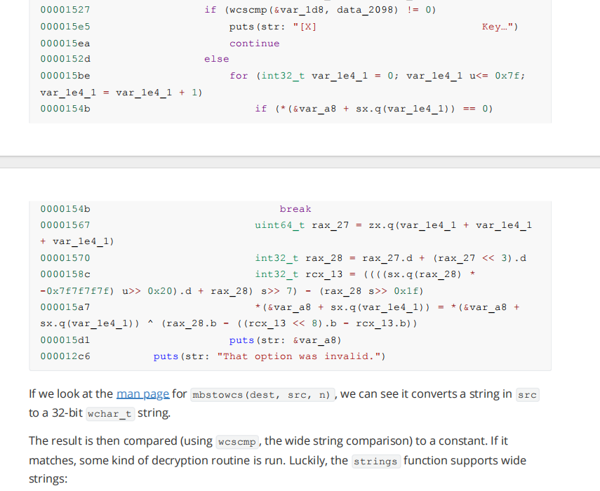

# Challenge Name

**Category:** Reverse Engineering
**Difficulty:** Very Easy
**Platform:** HTB 
**Binary:** wide & db.ex

## 📝 Challenge Description
We've received reports that Draeger has stashed a huge arsenal in the pocket dimension Flaggle Alpha. You've managed to smuggle a discarded access terminal to the Widely Inflated Dimension Editor from his headquarters, but the entry for the dimension has been encrypted. Can you make it inside and take control?

## 🔍 Initial Recon
```bash
root@kali:~/Documents/htb# ./wide db.ex
[*] Welcome user: kr4eq4L2$12xb, to the Widely Inflated Dimension Editor [*]
[*]    Serving your pocket dimension storage needs since 14,012.5 B      [*]
[*]                       Displaying Dimensions....                      [*]
[*]       Name       |              Code                |   Encrypted    [*]
[X] Primus           | people breathe variety practice  |                [*]
[X] Cheagaz          | scene control river importance   |                [*]
[X] Byenoovia        | fighting cast it parallel        |                [*]
[X] Cloteprea        | facing motor unusual heavy       |                [*]
[X] Maraqa           | stomach motion sale valuable     |                [*]
[X] Aidor            | feathers stream sides gate       |                [*]
[X] Flaggle Alpha    | admin secret power hidden        |       *        [*]
Which dimension would you like to examine? 6
[X] That entry is encrypted - please enter your WIDE decryption key: 
```

## 🔧 Analysis
Tools: radare2

Steps:
```Dynamic analysis (radare2)
r2 ./wide db.exe
aaa
afl
s sym.menu
pdg

```

Menu Function:
```
        sym.imp.printf("[X] That entry is encrypted - please enter your WIDE decryption key: ");
        sym.imp.fgets(auStack_c8,0x10,_reloc.stdin);
        sym.imp.mbstowcs(auStack_1c8,auStack_c8,0x10);
        iVar1 = sym.imp.wcscmp(auStack_1c8,L"sup3rs3cr3tw1d3");
        if (iVar1 == 0) {
            for (uStack_1d4 = 0; (uStack_1d4 < 0x80 && (*(&uStack_98 + uStack_1d4) != '\0'));
                uStack_1d4 = uStack_1d4 + 1) {
                *(&uStack_98 + uStack_1d4) = *(&uStack_98 + uStack_1d4) ^ uStack_1d4 * 0x1b + (uStack_1d4 * 0x1b) / 0xff
                ;
            }
            sym.imp.puts(&uStack_98);
        }
        else {
            sym.imp.puts("[X]                          Key was incorrect                           [X]");
        } while( true );

```
wcscmp compare two strings return 0 if they are both the same. And auStack_1c8 is the input twe insert.

## Result
root@kali:~/Documents/htb# ./wide db.ex
[*] Welcome user: kr4eq4L2$12xb, to the Widely Inflated Dimension Editor [*]
[*]    Serving your pocket dimension storage needs since 14,012.5 B      [*]
[*]                       Displaying Dimensions....                      [*]
[*]       Name       |              Code                |   Encrypted    [*]
[X] Primus           | people breathe variety practice  |                [*]
[X] Cheagaz          | scene control river importance   |                [*]
[X] Byenoovia        | fighting cast it parallel        |                [*]
[X] Cloteprea        | facing motor unusual heavy       |                [*]
[X] Maraqa           | stomach motion sale valuable     |                [*]
[X] Aidor            | feathers stream sides gate       |                [*]
[X] Flaggle Alpha    | admin secret power hidden        |       *        [*]
Which dimension would you like to examine? 6
[X] That entry is encrypted - please enter your WIDE decryption key: sup3rs3cr3tw1d3
HTB{som3_str1ng5_4r3_w1d3}


## Reference From Official Writeup

I also learned that wide string is 32-bit. The flag is hidden using 32-bit encryption method.
Normal strings method can only find 16-bit string. We can specify the encoding method by -eL where L represents 32-bit littleendian. 

strings -eL wide

```
/Documents/htb# strings -eL wide
 sup3rs3cr3tw1d3
```

## Flag
HTB{som3_str1ng5_4r3_w1d3}
